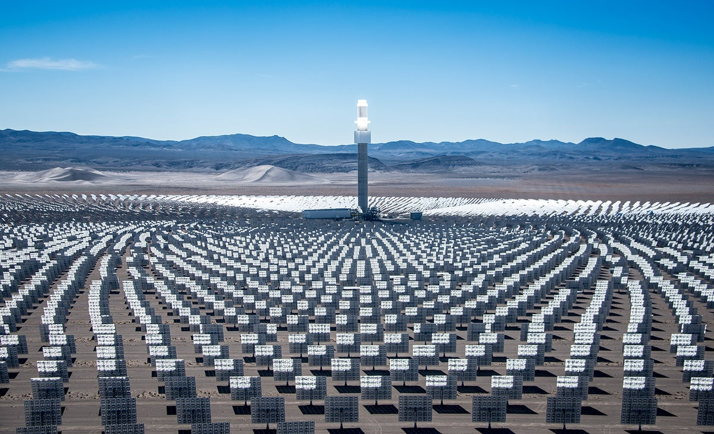
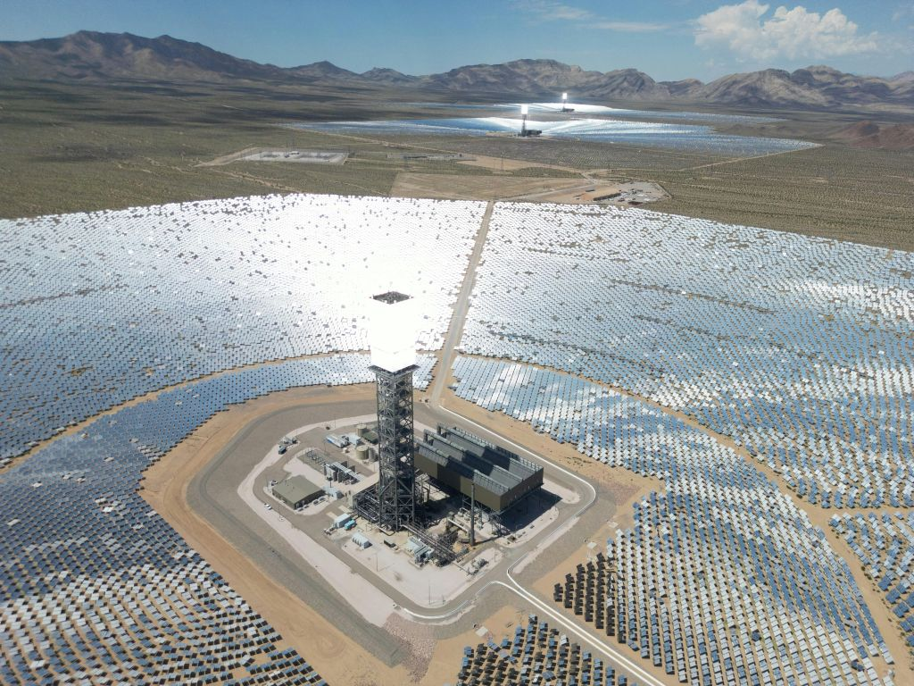
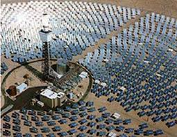
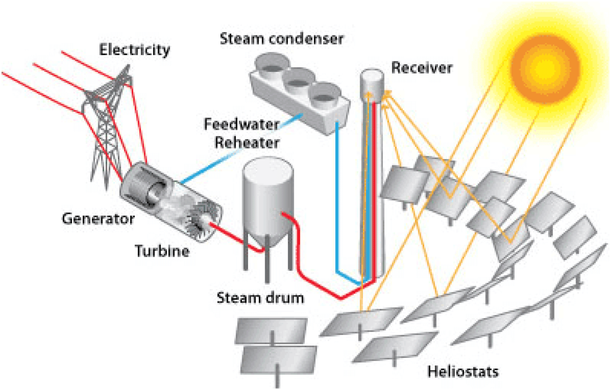

[3/25/2026 6:58 PM] Arvin Arpanahi: # 🌊 Solar Desalination & Mineral Recovery Project

🚀 A large-scale, solar-powered desalination platform designed to deliver sustainable water, energy, and industrial resources across the Persian Gulf region.

---

## 📌 Executive Summary

This project proposes the development of a next-generation desalination infrastructure based on Concentrated Solar Power (CSP – solar tower technology).

By integrating:

- Solar thermal energy
- Industrial desalination systems
- Mineral recovery processes

the project transforms seawater into multiple revenue streams, including fresh water, clean energy, and industrial minerals.

It is designed as a long-term infrastructure platform for coastal deployment in the Persian Gulf region, with strong potential for industrial integration, scalable expansion, and environmentally responsible resource production.

---

## 🌍 Strategic Positioning

This is not a standalone desalination plant.

It is a scalable infrastructure platform designed for:

- Regional deployment
- Industrial integration
- Long-term sustainable resource production

The project is intended to support growing water demand, reduce dependence on fossil-fuel-based desalination, and create additional economic value through energy and mineral recovery.

---

## 🧩 Overview

## 🔧 System Overview

The project is based on a circular heliostat field that concentrates solar radiation onto a central tower receiver. The resulting high-temperature thermal energy is used to power desalination processes and support continuous operation through thermal storage.

Key characteristics:

- Solar-powered operation with low carbon intensity
- High-efficiency thermal energy generation
- Modular and scalable design
- Integration with desalination and mineral recovery systems
- Potential for phased implementation based on investment scale

---

## ⚙️ Core Technology

### ☀️ CSP Solar Tower

Core CSP components include:

- Heliostat mirror field
- Central receiver tower
- Operating temperature: 500–1000°C
- Thermal storage using molten salt
- Capability for continuous and stabilized operation

This architecture allows solar energy to be concentrated and converted into usable thermal energy for large-scale industrial processes.

---

### ⚙️ System Operation

The system captures solar radiation through a field of mirrors arranged around a central tower. The mirrors reflect sunlight toward the receiver, generating high-temperature heat. This heat can then be used directly in desalination processes or stored for more stable operation.

---

### 💧 Desalination

Primary desalination technologies considered for the project:

#### MED (Multi-Effect Distillation)
- Optimized for thermal integration
- High efficiency when combined with CSP
- Lower operational intensity in suitable thermal configurations

#### MSF (Multi-Stage Flash)
- Proven large-scale industrial technology
- Robust and widely used
- Higher energy demand compared to MED

The final configuration would depend on site conditions, scale, water chemistry, and investment strategy.

---

### 🧂 Mineral Recovery

Potential mineral outputs from desalination brine include:

- Sodium Chloride (NaCl)
- Potassium Sulfate (K₂SO₄)
- Sodium Sulfate
- Magnesium salts
- Future potential: Lithium extraction, subject to economic and chemical feasibility

This component strengthens the business case by turning brine from a disposal challenge into a potential industrial resource stream.

---

## 📊 Project Scale (Concept)

| Parameter | Range |
|----------|------|
| Water Output | 100,000 – 300,000 m³/day |
| Power Capacity | 100 – 250 MW |
| Land Area | 5,000 – 15,000 hectares |
| Estimated CAPEX | $800M – $2B |

These figures represent a concept-level range and are intended as a strategic planning framework for phased development and investor evaluation.

---

## 💰 Revenue Model
[3/25/2026 6:58 PM] Arvin Arpanahi: The project is designed around a multi-stream revenue structure:

### 1. Water Supply
- Municipal water delivery
- Industrial water contracts

### 2. Energy
- Internal energy use for operations
- Optional grid export where permitted and economically viable

### 3. Minerals
- Industrial salt products
- Fertilizer-related outputs
- Chemical and processing market applications

👉 Diversification reduces concentration risk and improves long-term project resilience.

---

## ⏱️ Development Timeline

### Phase 1 – Feasibility & Concept
Duration: 6–12 months

- Site selection
- Solar resource assessment
- Seawater and brine characterization
- Initial financial modeling
- Environmental pre-assessment

### Phase 2 – Engineering & Partnerships
Duration: 12–18 months

- Technology partner selection
- FEED engineering
- Process integration design
- Permitting strategy
- Commercial and industrial alignment

### Phase 3 – Financing & Contracting
Duration: 6–12 months

- Investor engagement
- Capital structuring
- EPC and supplier negotiations
- Contract preparation

### Phase 4 – Construction
Duration: 24–36 months

- CSP installation
- Desalination plant construction
- Thermal storage integration
- Brine and mineral handling systems
- Utility and logistics infrastructure

### Phase 5 – Operation
Start: Year 5 onward

- Commissioning
- Initial water production
- Operational scaling
- Optimization of energy and mineral streams

---

## 🧠 Total Development Timeline

👉 Estimated total time to full-scale operation: 4 to 6 years

---

## 🏗 Implementation Model

This is a large-scale infrastructure project, not a standalone device.

Its implementation structure may include:

- Project Developer
- Technology Providers
- EPC Contractor
- Strategic Investors
- Local Infrastructure and Industrial Partners

The project can be developed in a phased format, allowing expansion in line with financing, land availability, market demand, and technical readiness.

---

## 🇩🇰 Strategic Advantage (Denmark – Aalborg)

The project is initiated from Aalborg, Denmark, creating a meaningful strategic advantage through:

- Direct access to advanced energy and thermal technology companies
- Faster engagement with potential technical partners
- Reduced coordination risk during early development
- Strong connection to a mature engineering ecosystem

This improves credibility during the concept and partner-matching phase.

---

## 🤝 Potential Technology Partners

### Denmark
- Aalborg CSP
- Arcon-Sunmark

### Europe
- SENER
- Abengoa

### Global
- ACWA Power
- Veolia

These companies represent examples of relevant expertise in solar thermal systems, large-scale infrastructure, and desalination-related project development.

---

## 📬 Partnership Approach

Potential engagement pathways include:

- Direct business development contact
- Formal concept proposal submission
- Structured technical and commercial dialogue
- Professional outreach through institutional and industry channels

---

## ⚠️ Key Challenges

- High capital investment requirements
- Complex integration between solar, desalination, and mineral systems
- Land, logistics, and infrastructure demands
- Cooling design and process optimization
- Environmental management of concentrated brine streams
- Need for strong technical and financial partners

These challenges are typical of large-scale infrastructure projects and can be addressed through phased planning, experienced engineering support, and disciplined project structuring.

---

## 🌱 Strategic Value

The project offers strategic value in multiple dimensions:

- Sustainable water production
- Clean energy utilization
- Industrial mineral recovery
- Lower long-term environmental footprint
- Reduced dependence on fossil-fuel-driven desalination
- Strong relevance for water-stressed coastal regions

---

## 🚀 Vision

To build a scalable, solar-powered desalination and resource recovery infrastructure that transforms seawater into a long-term economic and environmental asset for the Persian Gulf region.

---
[3/25/2026 6:58 PM] Arvin Arpanahi: ## 📊 Project Pitch

👉 [View Pitch Overview](./pitch.md)
